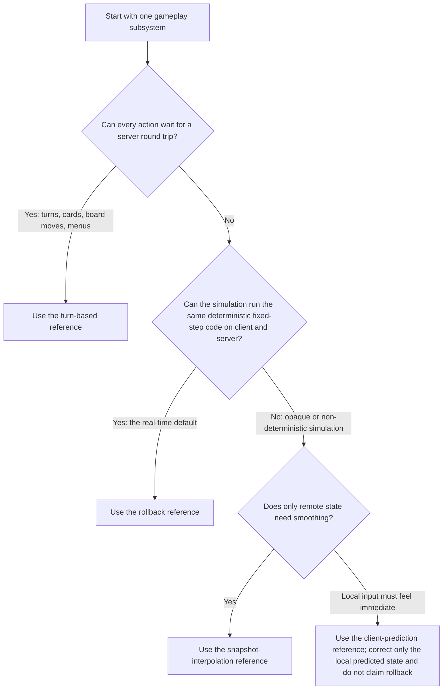
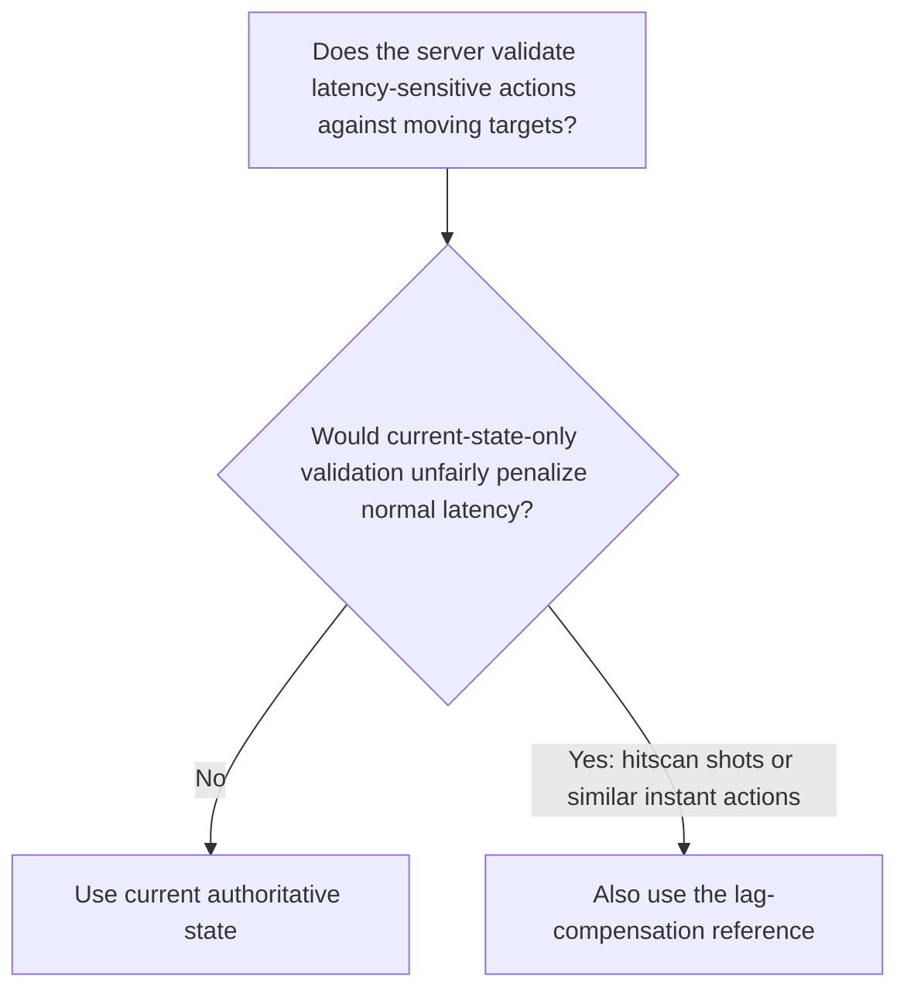
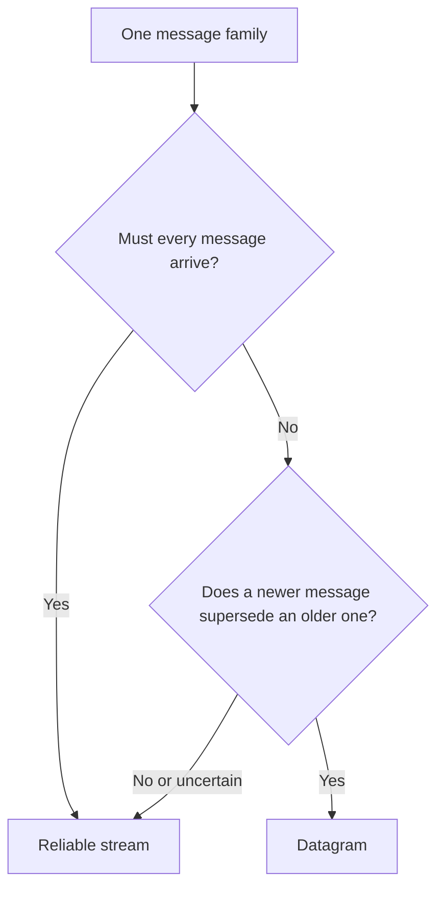

# Build Snack.Game Multiplayer

Give discrete subsystems the simplest model that meets their needs, and default continuous
real-time gameplay to one deterministic simulation predicted on the client and corrected by
rollback. Implement from this skill's approach references. Never use delay-based lockstep — a
client speculates and corrects; it does not stall waiting for inputs.

## Read First

Read:

- `AGENTS.md` and `snack.json`
- `src/client.ts`, `src/server.ts`, and relevant `src/shared/*`
- `.snack/types/client.d.ts` and `.snack/types/server.d.ts`
- [references/messaging-api.md](references/messaging-api.md) for the exact Snack send/receive APIs

Keep the server authoritative regardless of the selected presentation technique. Treat client
messages as untrusted input.

## Select Per Subsystem

Different parts of one game may choose different paths. For example, use reliable streams for
lobby/turn/match events and datagrams plus interpolation for movement.

Determinism is buildable, not a lucky property: `jolt-ts` supplies cross-platform deterministic 3D
physics (use [`snack-3d-physics`](../snack-3d-physics/SKILL.md)), and the game supplies a fixed
tick, seeded randomness, and canonical ordering. Prefer building determinism over falling back,
especially for games with many networked physics bodies — inputs and corrections stay small while
replicated per-body state does not.

For a genuinely non-deterministic real-time game that also needs immediate local response, use
snapshot interpolation as the correctness architecture. Optionally animate a narrow,
non-authoritative presentation proxy: visual feedback or a simple kinematic transform that is
corrected to authority and is never fed into physics, collision, hits, or game state. Do not
select client prediction alone for an opaque non-deterministic world.

Then select any additional server validation technique:

Lag compensation is server-side historical validation, not a replacement for snapshots, prediction,
or rollback. Projectile travel, movement, score, ammo, and cooldowns remain authoritative under the
game's primary approach.

## Approach References

| Approach                                                       | Use when                                                                                                                                     | Typical channels                                                                            |
| -------------------------------------------------------------- | -------------------------------------------------------------------------------------------------------------------------------------------- | ------------------------------------------------------------------------------------------- |
| [turn-based](references/turn-based.md)                         | Actions can wait for authority; state changes are discrete.                                                                                  | Reliable streams for commands and results/state.                                            |
| [rollback](references/rollback.md)                             | The real-time default: the simulation (with `jolt-ts` physics via `snack-3d-physics`) runs the same deterministic code on client and server. | Datagrams for inputs and state snapshots or tick frames; streams for bootstrap/checkpoints. |
| [snapshot-interpolation](references/snapshot-interpolation.md) | The simulation cannot be made deterministic and remote presentation needs smoothing.                                                         | Datagrams for inputs/snapshots; streams for bootstrap and critical events.                  |
| [client-prediction](references/client-prediction.md)           | A non-deterministic game still needs immediate local response for a narrow, correctable local subsystem.                                     | Datagrams for inputs/snapshots; streams for bootstrap and critical events.                  |
| [lag-compensation](references/lag-compensation.md)             | The server must fairly validate instant actions against recent authoritative target history.                                                 | Datagram or stream input according to frequency; authoritative result events.               |

Each approach has a complete worked example: [turn-based](references/turn-based-example.md),
[snapshot-interpolation](references/snapshot-interpolation-example.md),
[client-prediction](references/client-prediction-example.md),
[rollback](references/rollback-example.md), and
[lag-compensation](references/lag-compensation-example.md).

Read only the selected approach references and their examples. A game may use more than one when
separate subsystems have different requirements.

## Choose The Channel

- Use streams for turns, commands, acknowledgements, bootstrap state, inventory, match start/end,
  and other must-arrive events.
- Use datagrams for frequent input samples, transforms, and snapshots where late data is less useful
  than newer data.
- Keep encoded Internet datagrams within a conservative 1,000-byte budget; `maxSize` is only the
  Snack validation ceiling.
- Use binary gameplay packets from the first implementation. Keep shared encode/decode functions,
  stable byte-level test vectors, and human-readable debug formatters in `src/shared/`.
- Add application sequence, acknowledgement, idempotency, and ordering rules when game semantics
  require them; transport delivery alone is not enough.
- Give each receive queue one owner. When combining leaf examples, merge their parsers into one
  client/server router per channel; two async iterators or drain loops can consume each other's
  messages.

Read [references/protocol-design.md](references/protocol-design.md) when defining message shapes,
binary encoding, validation, debug formatting, retries, or ordering. Use
[`snack-design-binary-protocol`](../snack-design-binary-protocol/SKILL.md) when a message family
needs bitpacking, quantization, delta compression, or a priority accumulator to fit the datagram
budget.

## Record The Decision

Before implementation, state:

- authority and trust boundary
- acceptable input-to-feedback latency
- deterministic versus non-deterministic simulation boundary
- selected approach per subsystem
- datagram versus stream choice per message family
- binary packet layouts, codec ownership, debug formatters, and golden byte vectors
- required sequence, tick, revision, acknowledgement, and idempotency fields
- bootstrap, disconnect, fresh-launch rejoin, and recovery behavior
- network conditions that must pass

If determinism is uncertain, select snapshots or limited prediction first. Prove deterministic
replay with tests before selecting rollback.
