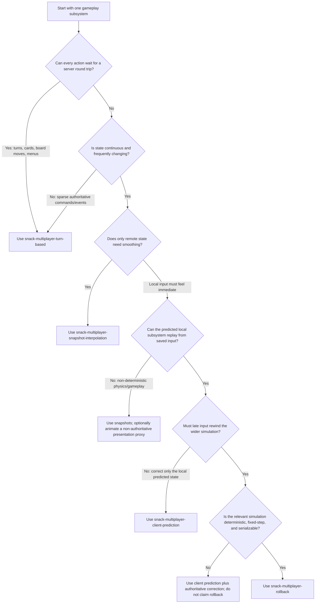
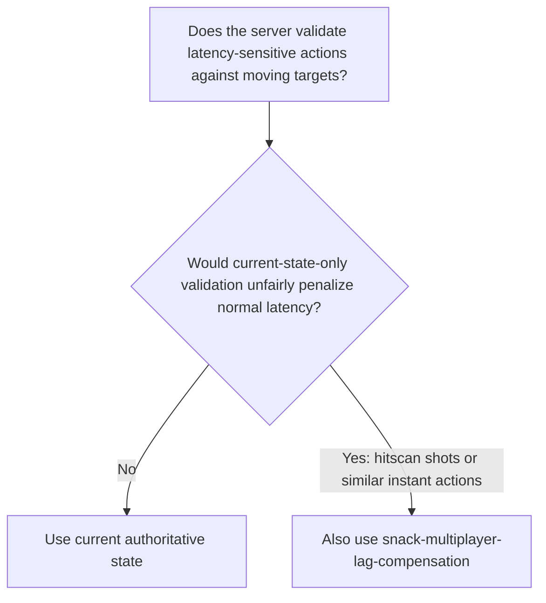
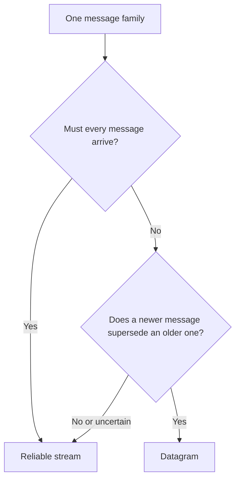

# Choose A Snack.Game Multiplayer Approach

Route each gameplay subsystem to the simplest networking model that meets its latency and
correctness requirements. Do not begin with prediction or rollback by default.

## Read First

Read:

- `AGENTS.md` and `snack.json`
- `src/client.ts`, `src/server.ts`, and relevant `src/shared/*`
- `.snack/types/client.d.ts` and `.snack/types/server.d.ts`
- [references/messaging-api.md](references/messaging-api.md) for the exact Snack send/receive APIs

Keep the server authoritative regardless of the selected presentation technique. Treat client
messages as untrusted input.

## Select Per Subsystem

Different parts of one game may choose different paths. For example, use reliable streams for
lobby/turn/match events and datagrams plus interpolation for movement.

For a non-deterministic real-time game that also needs immediate local response, use snapshot
interpolation as the correctness architecture. Optionally animate a narrow, non-authoritative
presentation proxy: visual feedback or a simple kinematic transform that is corrected to authority
and is never fed into physics, collision, hits, or game state. Do not select client prediction alone
for an opaque non-deterministic world.

Then select any additional server validation technique:

Lag compensation is server-side historical validation, not a replacement for snapshots, prediction,
or rollback. Projectile travel, movement, score, ammo, and cooldowns remain authoritative under the
game's primary approach.

## Approach Skills

| Approach                                                                                           | Use when                                                                                          | Typical channels                                                               |
| -------------------------------------------------------------------------------------------------- | ------------------------------------------------------------------------------------------------- | ------------------------------------------------------------------------------ |
| [`snack-multiplayer-turn-based`](../snack-multiplayer-turn-based/SKILL.md)                         | Actions can wait for authority; state changes are discrete.                                       | Reliable streams for commands and results/state.                               |
| [`snack-multiplayer-snapshot-interpolation`](../snack-multiplayer-snapshot-interpolation/SKILL.md) | A non-deterministic or continuous authoritative simulation needs smooth remote presentation.      | Datagrams for inputs/snapshots; streams for bootstrap and critical events.     |
| [`snack-multiplayer-client-prediction`](../snack-multiplayer-client-prediction/SKILL.md)           | Local controls must react immediately and a limited local subsystem can be replayed or corrected. | Datagrams for inputs/snapshots; streams for bootstrap and critical events.     |
| [`snack-multiplayer-rollback`](../snack-multiplayer-rollback/SKILL.md)                             | Late inputs must change past simulation and the relevant simulation is provably deterministic.    | Datagrams for tick inputs/frames; streams for checkpoints and critical events. |
| [`snack-multiplayer-lag-compensation`](../snack-multiplayer-lag-compensation/SKILL.md)             | The server must fairly validate instant actions against recent authoritative target history.      | Datagram or stream input according to frequency; authoritative result events.  |

Load only the selected approach skills. A game may load more than one when separate subsystems have
different requirements.

## Choose The Channel

- Use streams for turns, commands, acknowledgements, bootstrap state, inventory, match start/end,
  and other must-arrive events.
- Use datagrams for frequent input samples, transforms, and snapshots where late data is less useful
  than newer data.
- Keep encoded Internet datagrams within a conservative 1,000-byte budget; `maxSize` is only the
  Snack validation ceiling.
- Add application sequence, acknowledgement, idempotency, and ordering rules when game semantics
  require them; transport delivery alone is not enough.
- Give each receive queue one owner. When combining leaf examples, merge their parsers into one
  client/server router per channel; two async iterators or drain loops can consume each other's
  messages.

Read [references/protocol-design.md](references/protocol-design.md) when defining message shapes,
validation, JSON/binary encoding, retries, or ordering.

## Record The Decision

Before implementation, state:

- authority and trust boundary
- acceptable input-to-feedback latency
- deterministic versus non-deterministic simulation boundary
- selected approach per subsystem
- datagram versus stream choice per message family
- required sequence, tick, revision, acknowledgement, and idempotency fields
- bootstrap, disconnect, fresh-launch rejoin, and recovery behavior
- network conditions that must pass

If determinism is uncertain, select snapshots or limited prediction first. Prove deterministic
replay with tests before selecting rollback.
